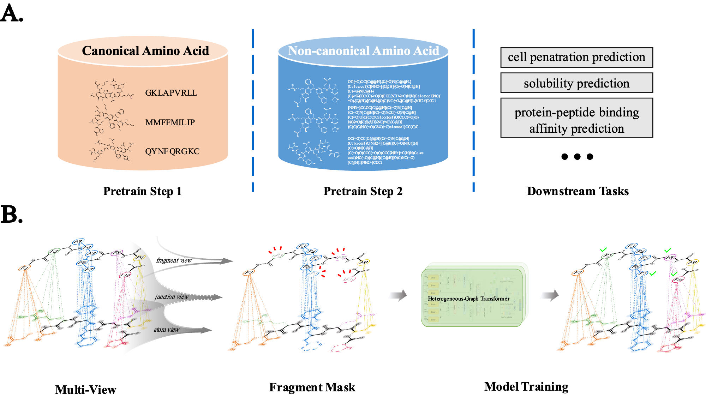
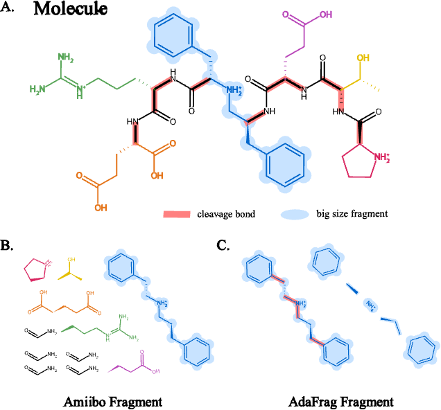
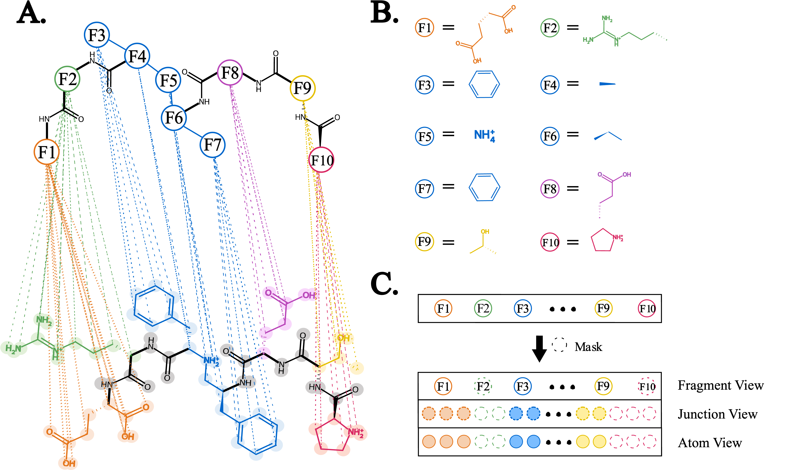
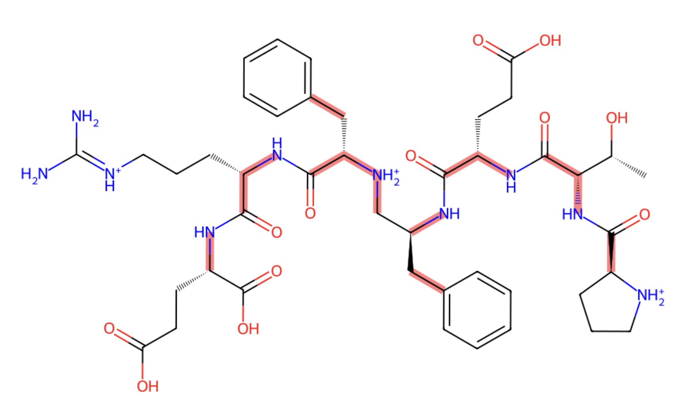

- [PepLand](#pepland)
  - [Introduction](#introduction)
    - [Pepland Architecture](#pepland-architecture)
    - [Fragmentation Operator](#fragmentation-operator)
    - [Multi-view Heterogeneous Graph](#multi-view-heterogeneous-graph)
  - [Installation](#installation)
  - [Inference using pretrained PepLand](#inference-using-pretrained-pepland)
  - [Data](#data)
  - [Training](#training)
  - [AdaFrag](#adafrag)

# PepLand

This repository contains the code for the paper [PepLand: a large-scale pre-trained peptide representation model for a comprehensive landscape of both canonical and non-canonical amino acids](https://arxiv.org/abs/2311.04419).

## Introduction

Pre-existing models, such as the Evolutionary Scale Modeling (ESM) and ProteinBert, leverage amino acid sequences to learn and predict coevolutionary information embedded in protein sequences. These models have showcased noteworthy success in protein-related tasks, but their efficacy is compromised when dealing with **peptides**.Furthermore, a critical limitation observed in models such as ESM is their incapacity to effectively handle **non-canonical amino acids**, which are frequently used to enhance the pharmaceutical properties of peptides.There are some researchers who might use **models from the field of ligands(small molecules)** to extract the representation of peptides11, but our results also indicate that this is not a suitable approach.

We herein propose `PepLand`, a novel pre-training architecture for **representation and property analysis of peptides spanning both canonical and non-canonical amino acids**. In essence, PepLand leverages a comprehensive **multi-view heterogeneous graph neural network** tailored to unveil the subtle structural representations of peptides. Our model ingeniously amalgamates a multi-view heterogeneous graph that comprises both atom and fragment views, thus enabling a comprehensive representation of peptides a varying granular levels.

Empirical validations underscore PepLand's effectiveness across an array of **peptide property predictions**, encompassing **protein-protein interactions**, **permeability**, **solubility**, and **synthesizability**. The rigorous evaluation confirms PepLand's unparalleled capability in capturing salient synthetic peptide features, thereby laying a robust foundation for transformative advances in peptide-centric research domains.

### Pepland Architecture



The overall workflow of proposed PepLand framework. (a) Two-stage training approach. PepLand will first be trained on peptide sequences containing only canonical amino acids, and then futher trained on peptide sequences containing non-canonical amino acids. After this, PepLand can be finetuned for downstream property prediction task. (b) PepLand uses a multi-view heterogeneous graph network to represent the molecular graph of peptides. Fragments of various granularities will be randomly masked for self-supervised pretraining.

### Fragmentation Operator

<p align="center">
  
</p>

Illustrations of the Amiibo and AdaFrag fragmentation operator. Amiibo operator breaks the molecules while preserving amino bonds, and continues further fragmenting large side chains using the BRICS algorithm (Degen, et al., 2008). (a) A example molecular graph of a peptide containing non-canonical amino acids, with each side chain highlighted in different colours. The Amiibo operator breaks all cleavaged bonds, preserving all amino bonds and cut the molecule into multiple fragments. (b) Output of the Amino Operator. It can be observed that, in addition to some peptide bonds and common side chains, there is a larger fragment covered by blue colour. (c) The Adafrag operator will further use the BRICS algorithm to break this large fragment.

### Multi-view Heterogeneous Graph



The multi-view feature representation framework of PepLand. (a) A peptide molecule can have multiple representations of views. The top F1-F10 in the figure represent fragment views, and the bottom represents atom-level views. Both atoms and fragments will learn a junction view representation. Homogeneous edges are formed within atoms and fragments. Heterogeneous edges are formed between atoms and fragments, as each fragment in the figure is connected to a specific subgraph structure below. (b) Molecular graph structures of F1-F10. They are connected by amino bonds. (c) Each representation of views will be randomly masked for self-supervised learning.

## Installation

```shell
conda env create -f environment.yaml
conda activate multiview
```

## Inference using pretrained PepLand

- Modify `configs/inference.yaml` to configure the inference

```
python inference.py
```

Average/max peptide readout defaults to `padding_mode: exclude`, pooling only
real atom and fragment nodes. Existing downstream checkpoints trained with padded
features should explicitly use `padding_mode: legacy` or be recalibrated/retrained.
See [padding compatibility and batch inference](inference/README.md#padding-compatibility)
for the feature scale change, API options, and verification commands.

## Data 

- We release all the evaluation datasets we collected in the `data/eval` folder.
- The `data` folder contains the pretraining and further training example data. We used the SMILES representation of peptides in the two steps of pretraining.  
- You can also use your own data by modifying the `train.csv`, `test.csv`, and `valid.csv` files in the `data` folder.
- The data is organized as follows:

```
---data
  ---eval
    ---- c-binding.csv
    ---- nc-binding.csv
    ---- c-CPP.txt
    ---- nc-CPP.csv
    ---- c-Sol.txt
  ---pretrained
    ----train.csv
    ----test.csv
    ----valid.csv
  ---further_training
    ----train.csv
    ----test.csv
    ----valid.csv
```


## Training

1. Modify `configs/pretrain_masking.yaml` to configure the training

- Masking Method

```bash
train.mask_pharm = True # random fragment masking
train.mask_rate = 0.8 # masking rate (random atom masking and random fragment masking)
train.mask_amino = 0.3 # or False, masking atoms of the same amino acid.
train.mask_pep = 0.8 # or False, masking atoms of side chains 
```

- Training Step1: Pretraining on canonical amino acids

```bash
train.dataset = pretrained
train.model = PharmHGT
```

- Training Step2: Pretraining on non-canonical amino acids

```bash
train.dataset = further_training
train.model = fine-tune
inference.model_path = ./inference/cpkt/ # here we used the pretrained cpkt as an exmaple output of first training step
```

- Message Passing Architecture

```bash
train.model = PharmHGT # HGT
```

2. Run training script

```bash
python pretrain_masking.py
```

## AdaFrag

1. Navigate to the tokenizer directory

```
cd tokenizer
```

2. Run the AdaFrag script

```bash
python pep2fragments.py
```

3. Examples:

```python
import os
import sys

from rdkit import Chem
from rdkit.Chem import AllChem
from rdkit.Chem import Draw
from pep2fragments import get_cut_bond_idx


smi = 'OC(=O)CC[C@@H](C(=O)N[C@@H](Cc1ccccc1)C[NH2+][C@H](C(=O)N[C@H](C(=O)N[C@H](C(=O)O)CCC(=O)O)CCC[NH+]=C(N)N)Cc1ccccc1)NC(=O)[C@H]([C@H](O)C)NC(=O)[C@H]1[NH2+]CCC1'
mol = Chem.MolFromSmiles(smi)

# side_chain_cut = True: AdaFrag 
# side_chain_cut = False: Amiibo

break_bonds, break_bonds_atoms = get_cut_bond_idx(mol, side_chain_cut = True)
highlight_bonds = []
for bond in mol.GetBonds():
    if bond.GetIdx() in break_bonds:
        highlight_bonds.append(bond.GetIdx())

# cleavaged bonds are highlighted in red.
Draw.MolToImage(mol, highlightBonds=highlight_bonds, size = (1000, 1000))
```


## Reproducible validation

Use an isolated environment; the historical training specification in
`environment.yaml` remains unchanged. The modern CPU validation environment uses
Python 3.11, Torch 2.2.2, DGL 1.1.3, RDKit 2023.9.6 and MLflow 2.22.2. From a Git checkout at the
repository root, install packages from PyPI and the official PyTorch CPU index:

```bash
python3.11 -m venv .venv
source .venv/bin/activate
python -m pip install --index-url https://download.pytorch.org/whl/cpu torch==2.2.2
python -m pip install --index-url https://pypi.org/simple \
  numpy==1.26.4 dgl==1.1.3 rdkit==2023.9.6 mlflow==2.22.2 \
  omegaconf==2.3.1 pandas==2.3.3 scipy==1.17.1 scikit-learn==1.9.1 tqdm==4.70.1
python -m pip install --index-url https://pypi.org/simple -r requirements-dev.txt
bash scripts/check.sh
PEPLAND_CHECKPOINT_TESTS=1 bash scripts/check.sh
```

The script runs the complete pytest suite, the repository-wide Ruff correctness
gate (`E9`, `F63`, `F7`, `F82`), type checks for `utils/readout.py` and
`utils/inference_config.py`, Python compilation and whitespace checks. It uses
one CPU thread and disables CUDA. The ordinary suite skips opt-in checkpoint
tests; set `PEPLAND_CHECKPOINT_TESTS=1` to exercise the bundled real MLflow
checkpoint at `inference/cpkt/model`. Data-loader regressions use bundled
peptides and temporary CSVs, without private dataset paths. Distributed loader
partition tests simulate ranks on CPU; they do not establish multi-process
training correctness or NCCL behavior.

The checked checkpoint is the pretrained representation model with pretraining
heads. It is not a saved downstream property-prediction checkpoint. Changes to
pooling can change feature scales used by previously trained downstream heads:
mean pooling now divides by each molecule's actual combined atom and fragment
count, and max pooling excludes padding even for negative features. Use the
explicit `legacy` compatibility mode when reproducing historical padding and
empty-relation batch behavior; verify or retrain existing downstream heads before
changing modes. The model no longer permanently removes a relation after an
edgeless input in either mode. Default mode also preserves the singleton node
state when another graph contributes a relation absent from that molecule.

The API/root CLI canonicalizes SMILES before graph construction; the standalone
CLI preserves the supplied atom order. Atom indices and embeddings across these
established preprocessing conventions need not match. Compare singleton and
batched results within the same pipeline.
Consult [inference documentation](inference/README.md) for the supported API and
configuration.

Validation boundaries: modern CPU tests are executed locally; no GitHub CI is
configured. Eight actual bundled checkpoint/API and saved reconstruction-head tests also
passed with Python 3.8.20, Torch 1.11.0+cpu, DGL 0.9.1, MLflow 1.30.0,
NumPy 1.23.5, RDKit 2023.9.6 and scikit-learn 1.3.2. This is a tested old-Torch
combination; the artifact does not pin DGL, so it is not an exact reconstruction
of its original runtime. Nine pure readout tests also passed with Torch 1.11.0.
Full bundled checkpoint/API inference and all three saved reconstruction heads
passed three GPU tests on an idle H200 with Python 3.11.16, Torch 2.2.2+cu121,
DGL 2.2.1+cu121 and TorchData 0.7.1. Tests use eval/no-grad, fresh graphs and
CPU/GPU comparisons (`rtol=atol=1e-4`), including pre-pooling features,
singleton/mixed orders and sizes, edgeless inputs, avg/max and legacy readout.
Peak allocated GPU memory was about 50.2 MiB. Earlier Torch 2.7.1+cu128 checks
covered only readout/GRU/reverse-edge helpers; their GraphBolt binary mismatch
was resolved for full inference by a separate matching Torch/DGL environment,
without modifying another environment or bypassing GraphBolt loading.
Trained downstream property checkpoint predictions and multi-process training
remain unverified. No GitHub CI is configured.

### Historical Torch checkpoint validation

On Linux x86_64, in a separate Python 3.8 environment, install the historical CPU Torch wheel
from the [official PyTorch index](https://pytorch.org/get-started/previous-versions/)
and DGL 0.9.1 from the [official DGL wheel repository](https://data.dgl.ai/wheels/repo.html).
DGL 1.1.3 requires Torch 1.13 or newer; use the tested 0.9.1 build with Torch 1.11.
The saved artifact records Torch 1.11.0 and MLflow 1.30.0 but does not record DGL.
The following command tests actual checkpoint inference, including saved
pretraining heads; it does not create or validate a historical downstream
property checkpoint:

```bash
python -m pip install --index-url https://download.pytorch.org/whl/cpu torch==1.11.0+cpu
python -m pip install --index-url https://pypi.org/simple \
  numpy==1.23.5 scipy==1.10.1 pandas==1.5.3 rdkit==2023.9.6 \
  mlflow==1.30.0 cloudpickle==2.2.1 docker==6.1.3 \
  scikit-learn==1.3.2 omegaconf==2.3.0 pytest==8.3.5
python -m pip install \
  https://data.dgl.ai/wheels/dgl-0.9.1-cp38-cp38-manylinux1_x86_64.whl
PEPLAND_CHECKPOINT_TESTS=1 CUDA_VISIBLE_DEVICES="" OMP_NUM_THREADS=1 \
  MKL_NUM_THREADS=1 OPENBLAS_NUM_THREADS=1 PYTEST_DISABLE_PLUGIN_AUTOLOAD=1 \
  python -m pytest -q test/test_checkpoint_readout.py test/test_checkpoint_compatibility.py
```

### GPU checkpoint validation

Use a separate Linux x86_64 Python 3.11 environment with one idle CUDA GPU.
The tested Torch 2.2.2/CUDA 12.1 and DGL 2.2.1 pairing follows the
[official DGL compatibility table](https://www.dgl.ai/pages/start.html) and
[matching wheel index](https://data.dgl.ai/wheels/torch-2.2/cu121/repo.html).
The DGL wheel includes `libgraphbolt_pytorch_2.2.2.so`; installing a newer Torch
without its matching GraphBolt binary is not a supported replacement.

```bash
python3.11 -m venv .venv-gpu
source .venv-gpu/bin/activate
python -m pip install --index-url https://download.pytorch.org/whl/cu121 torch==2.2.2
python -m pip install --index-url https://pypi.org/simple \
  numpy==1.26.4 torchdata==0.7.1 rdkit==2023.9.6 mlflow==2.22.2 \
  omegaconf==2.3.1 pandas==2.3.3 scipy==1.17.1 scikit-learn==1.9.1 tqdm==4.70.1 \
  pytest==9.1.1
python -m pip install --find-links https://data.dgl.ai/wheels/torch-2.2/cu121/repo.html \
  dgl==2.2.1+cu121
# Expose this environment's official CUDA libraries to DGL's dynamic loader.
export LD_LIBRARY_PATH="$(python -c 'import pathlib,sysconfig; print(":".join(str(p) for p in pathlib.Path(sysconfig.get_paths()["purelib"]).glob("nvidia/*/lib")))')${LD_LIBRARY_PATH:+:$LD_LIBRARY_PATH}"
python -m pip check
PEPLAND_GPU_CHECKPOINT_TESTS=1 CUDA_VISIBLE_DEVICES=0 OMP_NUM_THREADS=1 \
  MKL_NUM_THREADS=1 OPENBLAS_NUM_THREADS=1 PYTEST_DISABLE_PLUGIN_AUTOLOAD=1 \
  python -m pytest -q test/test_checkpoint_gpu.py
```

The GPU runner skips by default. When explicitly enabled it fails if CUDA is
unavailable or the selected GPU has another compute process, checking again
immediately before the first CUDA allocation. CUDA parameters, input graph
features and outputs are asserted explicitly; a skip or pure readout helper
check is not full checkpoint verification. GPU numerical comparisons use the
stated tolerance rather than promising bitwise CPU/GPU identity. Saved heads
are pretraining reconstruction heads, not trained downstream property models.
`scripts/check.sh` deliberately disables CUDA; run the GPU command separately.
